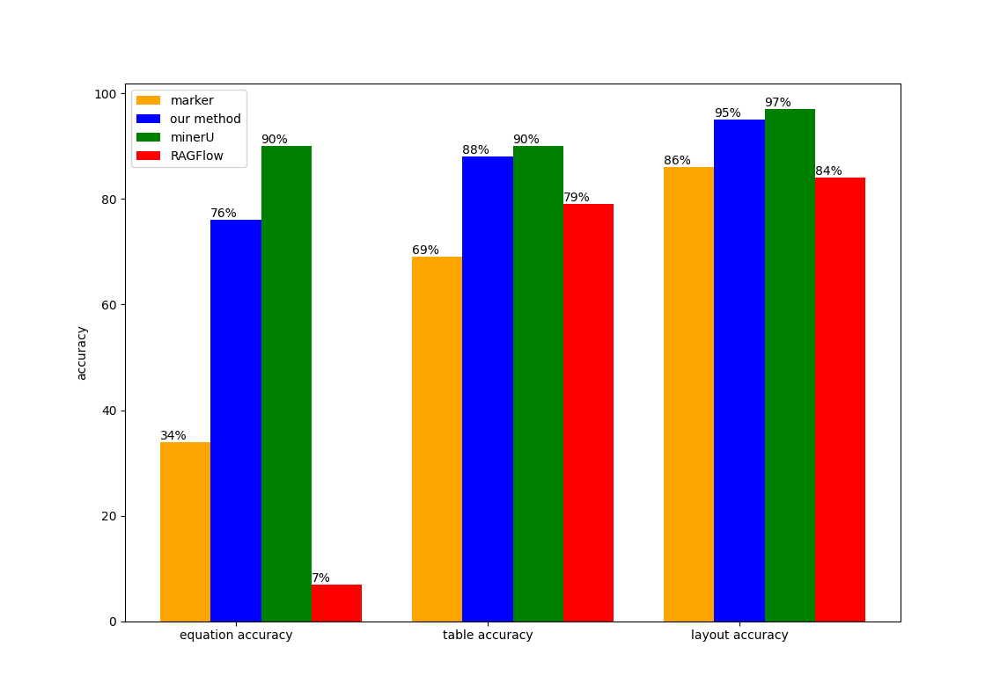

# llm-energy-doc-tool

简体中文 | [English](https://github.com/tsinghua-fib-lab/llm-energy-doc-tool/blob/main/README_en.md)

本工具将政策文件解析为 markdown，最终转换为格式化的 json 文件 。

## 工作流程

- 版式识别并保存图片
- 公式转换
- 表格转换
- 文字与标题转换
- 保存 markdown

## 效果

- pdf 原文件


- markdown


- 样例下载

  [PDF原文件](https://www.cnstock.com/image/202111/24/20211124114327324.pdf) | [转换结果](https://github.com/tsinghua-fib-lab/llm-energy-doc-tool/blob/main/assets/sample.md)

## 使用方法

1. `clone` 本项目：

   ```bash
   git clone https://github.com/tsinghua-fib-lab/llm-energy-doc-tool.git
   ```

2. 配置相关环境：

   1. Rapid-Layout：

      - 环境要求：

        - python 3.11
        - cuda 12.1
        - cudnn 8.9.0.6
        - requirements：见 `RapidLayout/requirements.txt`

      - 环境配置：

        1. 在 `RapidLayout` 下建立 python 环境，假定命名为 `venv`：

           ```bash
           # 使用 python 自带的虚拟环境
           cd RapidLayout
           python -m venv ./venv
           
           # 或者使用 conda
           cd RapidLayout
           conda create -p ./venv python=3.11
           ```
        
        2. 激活虚拟环境，安装 cuda 12.1, cudnn 8.9.0.6 并配置环境变量；
        
        3. 安装依赖包：
        
           ```bash
           # 在 RapidLayout 目录下
           pip install -r requirements.txt
           
           # 或许需要将 onnxruntime 替换为 onnxruntime-gpu
           pip list | grep onnxruntime # 若onnxruntime-gpu已装好，下面可跳过
           pip uninstall onnxruntime
           pip install onnxruntime-gpu --extra-index-url https://aiinfra.pkgs.visualstudio.com/PublicPackages/_packaging/onnxruntime-cuda-12/pypi/simple/
           ```

   2. TexTeller：

      - 环境要求：

        - python 3.11
        - cuda 12.1
        - cudnn 8.9.0.6
        - requirements：见 `TexTeller/requirements.txt`

      - 环境配置：

        1. 在 `TexTeller` 下建立 python 环境，假定命名为 `venv`：

           ```bash
           # 使用 python 自带的虚拟环境
           cd TexTeller
           python -m venv ./venv
           
           # 或者使用 conda
           cd TexTeller
           conda create -p ./venv python=3.11
           ```
        
        2. 激活虚拟环境，安装 cuda 12.1, cudnn 8.9.0.6 并配置环境变量；
        
        3. 安装依赖包：
        
           ```bash
           # 在 TexTeller 目录下
           pip install -r requirements.txt
           
           # 或许需要将 onnxruntime 替换为 onnxruntime-gpu
           pip list | grep onnxruntime # 若onnxruntime-gpu已装好，下面可跳过
           pip uninstall onnxruntime
           pip install onnxruntime-gpu --extra-index-url https://aiinfra.pkgs.visualstudio.com/PublicPackages/_packaging/onnxruntime-cuda-12/pypi/simple/

   3. PaddleOCR：

      - 环境要求：

        - python 3.11
        - cuda 12.0
        - cudnn 8.9.1
        - requirements：见 `PaddleOCR/requirements.txt`
        
      - 环境配置：
        1. 在 `PaddleOCR` 下建立 python 环境，假定命名为 `venv`：
      
           ```bash
           # 使用 python 自带的虚拟环境
           cd PaddleOCR
           python -m venv ./venv
           
           # 或者使用 conda
           cd PaddleOCR
           conda create -p ./venv python=3.11
           ```
        
        2. 激活虚拟环境，安装 cuda 12.0, cudnn 8.9.1 并配置环境变量；
      
        3. 安装 paddle 环境：
        
           1. 根据 [PP-Structure 快速开始](https://github.com/PaddlePaddle/PaddleOCR/blob/main/ppstructure/docs/quickstart.md#)之[1.准备环境](https://github.com/PaddlePaddle/PaddleOCR/blob/main/ppstructure/docs/quickstart.md#1-准备环境)中相关内容安装 paddle 环境；
        
           2. 下载模型：
        
              1. 在[1.1 中文检测模型](https://github.com/PaddlePaddle/PaddleOCR/blob/main/doc/doc_ch/models_list.md#1.1)处下载 `ch_PP-OCRv4_server_det` 模型，解压后放置在 `PaddleOCR/ppstructure/inference` 目录下；
              2. 在[2.1 中文识别模型](https://github.com/PaddlePaddle/PaddleOCR/blob/main/doc/doc_ch/models_list.md#21-中文识别模型)处下载 `ch_PP-OCRv4_server_rec` 模型。解压后放置在 `PaddleOCR/ppstructure/inference` 和 `PaddleOCR/ppocr/inference` 目录下；
              3. 在[2.2 表格识别模型](https://github.com/PaddlePaddle/PaddleOCR/blob/main/ppstructure/docs/models_list.md#22-表格识别模型)处下载 `ch_ppstructure_mobile_v2.0_SLANet` 模型，解压后放置在 `PaddleOCR/ppstructure/inference`目录下；
        
           3. 安装其它依赖包：
        
              ```bash
              # 在 PaddleOCR 目录下
              pip install -r requirements.txt
              ```
        
              

3. 启动服务：

   1. 启动公式识别服务：
      ```bash
      # 在 TexTeller 目录下
      python ./src/run_formula_api.py
      ```

   2. 启动表格识别服务：
      ```bash
      # 在 PaddleOCR 目录下
      python ./ppstructure/run_table_api.py
      ```
   3. 启动文字识别服务：
      ```bash
      # 在 PaddleOCR 目录下
      python ./tools/run_text_api.py
      ```
4. 运行：

   1. 将 `RapidLayout/parse_policy_layout.py` 中以下位置的参数按照自身需求修改：

      ```python
      if __name__ == '__main__':
       parse(input_dir="./input_pdf", output_dir="./output")
      ```

   2. 运行：
   
      ```bash
      # 在 RapidLayout 目录下
      python parse_policy_layout.py
      ```
   

## 基准测试

我们在大量的政策文件中随机抽取包含公式、表格的页面各50个。另随机抽取50个页面用于测试版式识别效果。随机抽取的页面及转换结果见 `benchmark/` 目录。

我们将这150个样本通过各工具进行转换，并进行人工检查。各工具的表现情况如下图：

### 政策文件

- 速度


- 准确性


### 图书

- 速度


- 准确性



