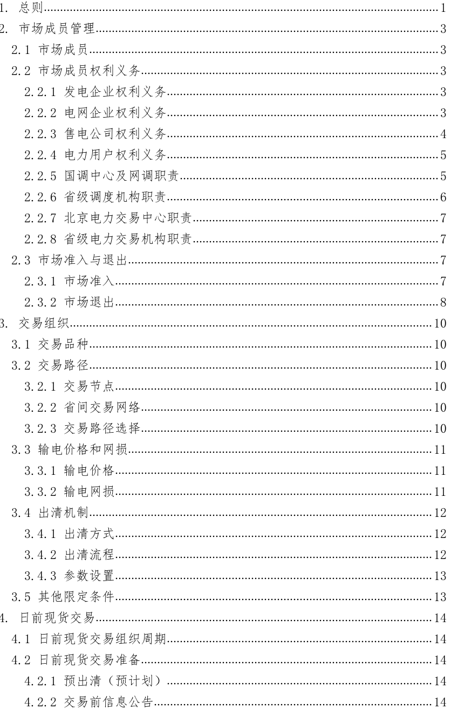

## 1.总则

（1）为落实《中共中央国务院关于进一步深化电力体
制改革的若干意见》（中发〔2015］9号）及配套文件精神，
充分利用省间通道输电能力，促进资源大范围优化配置和可
再生能源大范围消纳，规范开展省间电力现货交易，制定本
规则。
（2）本规则所称省间电力现货交易，主要是指在落实
省间中长期交易基础上，利用省间通道剩余输电能力，开展
省间日前、日内电能量交易，省间电力现货交易为实物交易。
（3）省间电力现货交易规则编制遵循以下原则：
确保电网安全运行。以确保电网安全稳定运行为前提，
市场设计充分考虑与现有电网运行管理体系和安全管理措
施有效衔接。
落实国家能源战略。体现国家能源发展战略，利用跨省
跨区输电通道，通过市场化手段开展电力余缺互济、促进清
洁能源大范围消纳，推动构建以新能源为主体的新型电力系
统，助力实现碳达峰、碳中和。
发挥市场配置作用。构建竞争有序的电力市场体系，充
分发挥市场在资源配置中的决定性作用，促进能源资源大范
围优化配置，提升市场效率与效益。
（4）省间电力现货交易由国家电力调度控制中心（以下简称国调中心)和区域电力调度控制中心（以下简称网调）
负责组织运营，省级电力调度控制中心（以下简称省调）和
电力交易机构按职责分工配合工作。初期，在国家电网有限
公司和内蒙古电力有限责任公司覆盖范围内开展试点。
（5）省间电力现货交易的所有市场成员，须遵守本规
则。

## 2.市场成员管理

## 2.1市场成员

市场成员包括发电企业、电网企业、售电公司、电力用
户及市场运营机构。市场运营机构包括国调中心、网调、省
调和北京电力交易中心、省级电力交易机构。加快健全相关
配套政策机制，推动符合准入条件的售电公司、电力用户参
与省间电力现货交易，优先鼓励有绿色电力需求的用户与新
能源发电企业参与省间电力现货交易。

## 2.2市场成员权利义务

## 2.2.1发电企业权利义务

（1）按规则参与省间电力现货交易，签订和履行市场
交易合同。
（2）公平获得输电服务和电网接入服务。
（3）公平获得市场运营相关信息。
（4）按规定披露和提供企业信息。
（5）执行并网调度协议，服从电力调度机构的统一调
度，按规定提供辅助服务。
（6）法律法规所赋予的其他权利和义务。

## 2.2.2电网企业权利义务

（1）保障电网设施的安全稳定运行。
（2）为市场主体提供公平的输配电服务和电网接入服
务。
（3）代理暂未直接参与市场交易的工商业用户和居
民、农业用户以价格接受者方式参与省间电力现货交易。过
渡期间可报量报价参与交易，代理购电价格可参考送受端市
场平均价格，也可由地方政府确定。
（4）为市场主体提供计量、抄表、收付费等各类市场
服务。
（5）负责省间电力现货交易电费结算，按规定收取输
配电费用，代国家收取政府性基金及附加等。
（6）省间电力现货交易的收支明细实施专账管理，接
受政府主管部门的监管。
（7）按规定披露和提供市场信息，承担保密义务和责
任。
（8）法律法规所赋予的其他权利和义务。

## 2.2.3售电公司权利义务

（1）符合准入条件的售电公司按规则参与省间电力现
货交易，签订和履行市场交易合同。
（2）公平获得输配电服务，拥有配电网的售电公司应
向其他市场主体提供公平的配电服务。（3）公平获得市场运营相关信息。
（4）按规定披露和提供信息。
（5）具备参与电力现货交易所需的计量条件。
（6）法律法规所赋予的其他权利和义务。

## 2.2.4电力用户权利义务

（1）符合准入条件的电力用户按规则参与省间电力现
货交易，签订和履行市场交易合同。
（2）公平获得输配电服务和电网接入服务。
（3）公平获得市场运营相关信息。
（4）按规定披露和提供信息。
（5）具备参与电力现货交易所需的计量条件。
（6）服从电力调度机构的统一调度，在系统特殊运行
状况下（如事故等），按电力调度机构要求安排用电。
（7）法律法规所赋予的其他权利和义务。

## 2.2.5国调中心及网调职责

（1）负责组织省间电力现货交易，负责建设、运行、
维护和管理省间电力现货交易技术支持系统。
（2）负责按调管范围开展安全校核。
（3）负责向相关调度机构下发直调系统发输电预计
划。直调机组参与所在省内现货交易的，可不下发其发电预
计划。（4）按信息披露相关规定向电力交易机构提供省间电
力现货交易相关信息。
（5）负责省间电力现货交易出清，并向相关调度机构
下发出清结果。
（6）根据省间电力现货交易出清结果，编制并下发直
调系统发输电计划。直调机组参与所在省内现货交易的，可
不下发其发电计划。
（7）负责向相关电力交易机构提供省间电力现货交易
出清结果、执行情况等信息。
（8）法律法规所规定的其他权利和义务。

## 2.2.6省级调度机构职责

（1）负责建设、运行、维护和管理本地省间电力现货
交易技术支持系统终端。
（2）负责按调管范围开展安全校核。
（3）负责组织省内市场预出清或预计划。
（4）按规定披露和提供输变电设备检修、机组检修、
省内重要断面可用输电容量参考值等信息。
（5）负责组织省内发电企业、售电公司、电力用户参
与省间电力现货交易。
（6）负责向相关电力交易机构提供省间电力现货交易
出清结果、执行情况等信息。（7）法律法规所规定的其他权利和义务。

## 2.2.7北京电力交易中心职责

（1）负责市场主体的注册管理。
（2）负责市场主体的交易申报及信息发布，负责建设、
维护和管理省间电力现货交易申报及发布功能。
（3）负责向市场成员出具包含电量、电价和电费的省
间电力现货交易结算依据，提供相关服务。
（4）负责建设、维护电力交易平台（技术支持系统）。
（5）法律法规所规定的其他权利和义务。

## 2.2.8省级电力交易机构职责

（1）负责市场主体注册工作。
（2）负责省内市场主体的交易申报及信息发布。
（3）配合北京电力交易中心开展信息披露有关工作。
（4）配合北京电力交易中心开展电力交易结算有关工
作。
（5）法律法规所规定的其他权利和义务。

## 2.3市场准入与退出

## 2.3.1市场准入

（1）市场主体由各地方政府主管部门负责准入，可在任一电力交易机构注册，一地注册、全国共享。
（2）市场主体已在电力交易机构完成市场注册手续，
并需具备电量分时计量要求。
（3）市场主体在参与省间电力现货交易前需阅知《省
间电力现货交易风险提示书》，并签订《省间电力现货交易
承诺书》（电子承诺书内容包括买卖双方的权利与义务、不
可抗力、争议解决、调整和违约、特别约定等）。
（4）满足政府主管部门其他相关准入条件。

## 2.3.2市场退出

## 2.3.2.1退出条件

除不可抗力外，市场主体参与交易申报后，在相应交易
周期完成前原则上不得退出。
市场主体有以下情形的，相关政府主管部门根据职能组
织调查确认，提出警告，勒令整改。拒不整改的市场主体将
被列入黑名单，按有关规定强制退出市场，有关法人、单位
和机构的违规情况记入信用评价体系：
（1）市场主体违反国家有关法律法规和产业政策规
定。
（2）发生重大违约行为。
（3）恶意扰乱市场秩序。
（4）未履行定期信息披露义务。
（5）拒绝接受监督检查。（6）拒绝缴纳或拖欠电费。
（7）无正当理由，拒不执行调度指令。

## 2.3.2.2退出程序

退出省间电力现货交易的市场主体，应妥善处理现货交
易相关事宜，由市场运营机构按规定进行注销，并向社会公
示。
市场主体退出市场后，停止其所有省间电力现货交易活
动。强制退出的市场主体，1年内不得参与省间电力现货交
易。

## 3.交易组织

## 3.1交易品种

省间电力现货的交易品种为卖方发电企业与买方电网
企业、售电公司、电力用户之间进行的电能量交易。

## 3.2交易路径

## 3.2.1交易节点

（1）在省间电力现货交易中，一般情况下1个省为1
个交易节点。当省内出现严重阻塞，且该阻塞相对频繁发生
时，可定义多个交易节点。
（2）国调中心、网调直调机组按照批复的电力消纳方
式确定其所属交易节点，省内消纳的机组纳入省内交易节
点，多省消纳的机组可设为独立交易节点。
（3）节点内以及同一省内不同节点间的市场主体不允
许开展省间电力现货交易。

## 3.2.2省间交易网络

省间交易网络由交易节点、跨省区交直流输电通道和省
内重要输电通道共同组成。

## 3.2.3交易路径选择

交易路径由卖方节点和买方节点之间的跨省区交直流
输电通道和省内重要输电通道顺序链接形成。任意一对卖
方、买方节点间可选择多条交易路径开展交易，优先选择节
点间输电价格（含网损折价）最低的交易路径开展交易。同
一交易路径不重复经过同一交易节点。

## 3.3输电价格和网损

## 3.3.1输电价格

（1）输电价格是顺序链接形成交易路径的各跨省区交
直流输电通道和各省内相关输电通道的输电价格之和。
（2）上述输电价格按政府主管部门核定价格执行，原
则上按照实际输送量收取输电费。省间电力现货交易涉及跨
省跨区专项工程的按照实际物理计量电量进行结算，省间电
力现货交易涉及区域共用电网无法按物理电量准确计量的，
可按实际交易电量收取输配电费，输配电价执行国家相关政
策，并报国家发改委、国家能源局备案。

## 3.3.2输电网损

（1）省间电力现货交易输电网损包括顺序链接形成交
易路径的各跨省区交直流输电通道和各省内相关输电通道
的输电网损。
（2）网损率按政府主管部门核定标准或备案标准执行。
（3）输电价格已包含网损的，不再另行收取。

（3）输电价格已包含网损的，不再另行收取。

## 3.4出清机制

## 3.4.1出清方式

省间电力现货交易采用集中竞价的出清方式。

## 3.4.2出清流程

（1）买方市场主体在所在节点申报分时“电力-价格”
曲线，考虑所有交易路径的输电价格和输电网损后，逐一折
算到卖方节点。
（2）在卖方节点，卖方市场主体报价按照从低到高排
序，买方市场主体折算后价格从高到低排序。
（3）按照买卖双方价差递减的原则依次出清，价差最
大的交易对优先成交，直至价差小于零或节点间交易路径可
用输电容量等于零。存在多个价差相同的交易对时，成交电
力按照交易申报电力比例进行分配。
（4）每成交一笔交易后，扣除该交易路径可用输电容
量以及买卖双方对应的申报量。
（5）卖方节点最后一笔成交交易对中买方折算后价格
与卖方申报价格的平均值为该卖方节点的出清价格。
（6）卖方节点价格叠加输电价格（含输电网损折价）为买方节点对应相应路径的出清价格。

## 3.4.3参数设置

为保证电网安全运行，满足输变电设备运行控制要求，
需要在出清过程中对相关参数进行设置。
（1）按时段对每条交易路径成交结果进行数据精度设
置，对交易路径中所有跨区通道的卖电侧出清电力进行取整
(直接舍弃小数位)。
（2）各跨省区联络线相邻时段的输电功率变化幅度不
超过600兆瓦；在市场出清时间内，当出现联络线成交量不
满足爬坡约束时，可按爬坡约束重新进行出清计算。

## 3.5其他限定条件

同一交易时段，市场主体是否可以买入或卖出电能，需
根据以下情况进行界定：
（1）交易节点内部可再生能源富余时，节点内部买方
市场主体不得在省间电力现货交易中买入电能。
（2）交易节点内部平衡紧张时，节点内部卖方市场主
体不得在省间电力现货交易中卖出电能。
（3）对于可再生能源是否富余和电力平衡是否紧张的
判定方法，由各地方政府主管部门确定或由各省调报地方政
府主管部门确认同意。

## 4.日前现货交易

## 4.1日前现货交易组织周期

（1）市场运营机构按日组织省间日前现货交易。
（2）交易日从00:15至24:00，每15分钟设为一个时
段，交易日共分96个时段。

## 4.2日前现货交易准备

## 4.2.1预出清 (预计划)

国调中心、网调从相关交易机构获取省间中长期电力交
易曲线。
国调中心D-2日编制D日96时段直调系统发输电预计
划（D日为运行日，下同）。
网调D-2日编制D日96时段调管范围内省间联络线及
直调机组发输电预计划。直调机组参与所在省内现货交易
时，可不编制其发电预计划。
省内现货市场运行期间，相应省调在D-1日开展D日96
时段省内预出清。省内现货市场未运行期间，相应省调在D-1
日编制D日96时段预计划。

## 4.2.2交易前信息公告

按照《电力现货市场信息披露办法（暂行）》（国能发监管〔2020］56号，以下简称56号文）要求，根据调度机
构向国家能源局及其派出机构报备的信息披露内容，由电力
交易机构负责披露检修计划、电网安全约束等省间日前现货
交易所需相关信息。

## 4.2.3交易申报

省内市场主体通过电力交易平台省内功能申报分时“电
力-价格”曲线，国调中心、网调直调机组可通过电力交易
平台省间功能或省内功能申报“电力-价格”曲线。卖方申
报上网侧电力和价格，买方申报落地侧电力和价格。

## 4.2.3.1市场主体申报数据基本要求

市场主体申报的分时“电力-价格”曲线应满足如下基
本要求：
（1）每一交易时段（15分钟）可申报的分段曲线最多
为5段。
（2）卖方市场主体申报的分段曲线要求为单调非递减
曲线。
（3）买方市场主体申报的分段曲线要求为单调非递增
曲线。
（4）申报电力最小单位为1兆瓦，申报价格最小单位
为1元/兆瓦时。
（5）市场主体报价最低为0元/兆瓦时，最高为10000元/兆瓦时。政府主管部门可根据市场运行情况对限价进行
调整。

## 4.2.3.2卖方市场主体申报数据要求

（1）火电和核电发电企业申报电力不得超过其实际发
电能力与预出清（预计划）之差，预出清（预计划）中未安
排开机的机组不得申报电力。
（2）可再生能源企业申报电力不得超过其预测出力与
预出清（预计划）之差。

买方市场主体申报的分时“电力-价格”曲线除满足
4.2.3.1节的基本要求外，售电公司、电力用户申报购入电
力不得超过其所代理用户或自身用电负荷的最大值。

## 4.2.3.4申报数据管理

（1）市场主体申报数据应满足规定要求，由技术支持
系统根据要求自动进行初步审核，初步审核不通过的不允许
提交。
（2）省调在数据上报前对市场主体申报量进行预校
核，保证交易节点内部电能申报量可送出或受入。
（3）网调对区域内各交易节点和直调发电企业申报量
进行预校核，保证区域内电能申报量可执行。（4）预校核不通过的交易申请，按照“价格优先、可
再生能源优先、节能环保优先”的原则依次调减。当以上条
件均相同时，按照申报电力等比例调减，直至通过预校核。

## 4.3日前现货交易出清

国调中心、网调依托省间电力现货交易技术支持系统组
织省间日前现货交易出清，出清机制与3.4节一致。

## 4.3.1电力和价格折算方法

将买方市场主体在买方节点申报的电力和价格按照所
有可用交易路径，依如下公式折算到卖方节点：
折算到卖方节点的买方市场主体价格=买方市场主体报
价-输电价格（含输电网损折价）。
折算到卖方节点的买方市场主体电力=买方市场主体申
报电力／（1-线路网损率）。

$$
\mathrm{power}_{ \text{买电},j,t}^{ \text{卖}} = \frac{\mathrm{power}_{ \text{买电},j,t}}{\mathrm{coe}_{ {}_{1}}}\newline \mathrm{price}_{ \text{买电},j,t}^{ \text{卖}} = \mathrm{price}_{ \text{买电},j,t}\times \mathrm{coe}_{ {}_{1}} \operatorname{-}\mathrm{price}_{ {}_{coe}}\newline \mathrm{coe}_{ {}_{1}} = \prod_{m= 1}^{N} \big( 1 -\rho_{{}_{m}}\big)\newline \mathrm{price}_{coe} = \sum_{\mathrm{m=1}}^{N} \left[ Pt_{m}\times \prod_{r=1}^{ \mathrm{m}} \big( 1 -\rho_{{}_{r}}\big) \right]
$$

其中：power买电为买方市场主体j在t时段的申报电力；
power卖电；为买方市场主体j在t时段申报电力折算到卖
方节点的电力；
price 买电，为买方市场主体j在t时段的申报价格；
price 卖买电为买方市场主体j在t时段申报价格折算到卖
方节点的价格；
coe，为折算参数；
pricecoe为中间折算变量；
m为交易路径中跨区通道、省间联络线或区域共用电网
的序号；
Pm为交易路径中自卖方节点至买方节点的第m段跨区
通道、省间联络线或区域共用电网的输电网损率；
Pt为交易路径中自卖方节点至买方节点的第m段跨区
通道、省间联络线或区域共用电网的输电价格；
N为交易路径中跨区通道、省间联络线或区域共用电网
的总个数。

## 4.3.2集中竞价出清

（1）买方市场主体在所在节点申报分时“电力-价格”
曲线，考虑所有交易路径的输电价格和输电网损后，逐一折
算到卖方节点。
（2）在卖方节点，卖方市场主体报价按照从低到高排序，买方市场主体折算后价格从高到低排序。
（3）按照买卖双方价差递减的原则依次出清，价差最
大的交易对优先成交，直至价差小于零或节点间交易路径可
用输电容量等于零。

$$
\Delta\mathrm{price}_{\text{交易对},i-j,t}=\operatorname{price}_{\text{买电},j,t}^{\text{卖}}-\operatorname{price}_{\text{卖电},i,t}
$$

其中：

其中：
△price交易对i-j为折算到卖方节点的买方市场主体j与卖
方市场主体i合的交易对在t时段的价差；
price卖买电.为买方市场主体j在t时段申报电价折算到卖
方节点的价格；
price卖电为卖方市场主体i在t时段的申报价格。
（4）存在价差相同的多个交易对时，按照申报电力比
例分配交易对中的卖方节点送出需求和买方节点受入需求。
交易对中卖方节点的送出需求分配：按照卖方节点在全
部价差相同交易对中涉及的各个买方节点申报电力的比例，
对该卖方节点申报电力进行分配，形成该交易节点外送各买
方节点的电力。

$$
\operatorname{power}_{{}_{\text{分配卖电},k,t}}=\operatorname{power}_{{}_{ \text{申报卖电},k,t}}\times\frac{\operatorname{power}_{{}_{\text{申报买电},k,t}}}{ \sum_{{}_{\rm r=1}}^{{}_{SG}}\operatorname{power}_{{}_{\text{申报买电},{\rm r },t}}}
$$

power分配卖电为交易对k在时刻的分配卖方电力；
power申报卖电k为交易对k在时刻的申报卖方电力；power申报买电为交易对k在t时刻的申报买方电力；
SG为价差相同且卖方市场主体相同的交易对对数。
交易对中买方节点的受入需求分配：按照买方节点在全
部价差相同交易对中涉及的各个卖方节点申报电力的比例，
对该买方节点申报电力进行分配，形成该交易节点受入各卖
方节点的电力。

$$
\operatorname{power}_{\text{分配买电},k,t}=\operatorname{power}_{\text{申报买电},k,t}\times\frac{\operatorname{power}_{\text{申报卖电},k,t}}{\sum\limits_{r=1}^{SS} \operatorname{power}_{\text{申报卖电},r,t}}
$$

其中：
power分配买电，为交易对k在t时刻的分配买方电力；
power申报买电，为交易对k在t时刻的申报买方电力；
power申报卖电,为交易对k在t时刻的申报卖方电力；
SS 为价差相同且买方市场主体相同的交易对对数。
（5）每个交易对中卖方节点送出电力和买方节点受入
电力中较小的值为该交易对在卖方节点的成交电力。
powerk, = min {power分配买电,k,,power分配卖电,k,
其中：
powerk,为交易对k在t时刻的成交电力；
power分配买电，为交易对k在t时刻的分配买方电力；
power分配卖电为交易对k在t时刻的分配卖方电力。
（6）考虑跨省区联络线输电容量对成交电力校验调
整。若相关交易对的成交电力超出某一跨省区联络线或输电断面的可用输电容量，则按比例缩减相关交易对的成交电
力，形成各交易对在对应跨省区联络线及输电断面上的成交
电力。

$$
\operatorname{power}_{ \text{调整后},k,t}=\operatorname{power}_{ k,t} \times\frac{T_{ \text{可用输电},l,t}}{T_{ \text{待成交},l,t}}
$$

其中：
1为t时刻越限最严重的跨省区联络线或输电断面；
T可用输电为跨省区联络线或输电断面1的可用输电容量；
T待成交为跨省区联络线或输电断面1在t时刻的待成交电
力；
powerk，为交易对k在t时刻调整前成交电力；
power调整后为交易对k在t时刻调整后成交电力。
（7）每成交一笔交易后，扣除该交易路径可用输电容
量以及买卖双方对应的申报量。
（8）剩余的买方市场主体申报量再次折算到卖方节
点，与卖方市场主体剩余申报量进行集中竞价出清。
（9）买卖双方在市场内依次出清，直至买方市场主体
或卖方市场主体申报电力全部成交，或买卖双方价差为负，
或买卖双方可成交节点间交易路径无可用输电容量，交易结
束。

## 4.3.3出清边际价格计算

与卖方申报价格的平均值为该卖方节点的边际价格。

price边际电价；=(price录最后买电，+price最后卖电)×0.5
其中：
price边际电价；为卖方市场主体i的出清边际价格；
price 录最后买电，为卖方节点最后一笔成交交易对的买方报价
折算到卖方节点的价格；
price最后卖电，为卖方节点最后一笔成交交易对的卖方报
价。
（2）卖方节点价格叠加交易路径的输电价格（含输电
网损折价）为买方节点对应相应路径的出清价格。
（3）买卖双方市场主体在竞价出清过程中成交的电力
按照上述买卖节点结算价格结算。

## 4.4安全校核

（1）国调中心、网调、省调按各自调管范围确定通道
可用输电能力或断面限额，省间电力现货交易出清过程闭环
考虑通道安全约束。
（2）省间电力现货交易出清后，国调中心统筹组织网
调、省调开展安全校核。安全校核未通过时，按照灵敏度由
高到低顺序，取消相关省间电力现货交易，消除设备越限，
出清边际电价不变。

## 4.5出清结果管理

非现货试点地区和现货试点地区现货市场未运行期间，
卖出电能量的发电企业按成交结果增加发电份额，买入电能
量的售电公司和电力用户扣除其参与省内市场的买电需求。
现货试点地区现货市场运行期间，省间电力现货交易卖方成
交结果作为送端关口负荷增量，买方成交结果作为受端关口
电源参与省内出清。

## 4.6日前现货交易结果发布

按照56号文相关要求，根据调度机构向国家能源局及
其派出机构报备的信息披露内容，由电力交易机构负责开展
日前市场各时段出清电价、出清电量等日前现货市场出清后
信息的披露工作。

## 4.7日前现货交易流程

## 4.7.1预计划下发

D-2日14:00-15:30，国调中心基于跨区中长期交易结
果，考虑电网安全运行需要，编制并下发跨区通道及直调机
组D日96时段预计划。
D-2日15:30-17:00，网调基于跨区通道、直调机组预
计划和省间中长期交易结果，考虑电网安全运行需要，编制
并下发省间联络线及直调机组D日96时段预计划。

## 4.7.2交易前信息公告

D-1日08:45前，电力交易机构向市场主体发布检修计
划、电网安全约束等日前现货交易所需相关信息。

## 4.7.3省内预出清 （预计划）

D-1日08:45-09:45，市场主体申报参加省内市场（电
力现货市场运行期间）的分时“电力-价格”曲线。
D-1日9:45-10:30，省内现货市场运行期间，相应省调
开展省内日前现货市场预出清；省内现货市场未运行时，省
调相应开展省内预计划编制。各单位根据预出清或预计划结
果将机组预计划、负荷预测等七大类数据上报至国调中心、
网调。
D-1日11:00前，省调将省内预出清或预计划结果、省
内电力平衡裕度和可再生能源富余程度提交至电力交易机
构，并向相关市场主体发布。

## 4.7.4交易申报

D-1日11:00-11:30，市场主体申报省间电力现货交易
分时“电力-价格”曲线。
D-1日11:30-11:45，省调对省内市场主体申报数据进
行合理性校验，保证节点内部电能申报量可送出或受入。省
调将省内各市场主体报价曲线上报至国调中心。
国调中心、网调对直调发电企业的申报量进行预校核，
保证电能申报量可执行。

## 4.7.5省间现货交易出清及跨区发输电计划编制

D-1日11:45-12:30，国调中心和网调组织省间日前现
货交易集中出清，形成考虑安全约束的省间日前现货交易出
清结果，经安全校核通过后，将包含省间日前现货交易结果
的跨区发输电日前计划下发至相关调度机构和市场主体。

## 4.7.6省间联络线计划编制

D-1日12:30-14:30，网调组织开展区域内省间辅助服
务交易，并将交易结果和省间联络线计划下发至相关省调和
发电企业。

## 4.7.7省内发电计划编制

D-1日14:30-17：30，省调根据上级调度机构下发的联
络线计划，编制省内日前发电计划或组织省内日前现货市场
及辅助服务市场（省间交易卖方成交结果作为送端关口负荷
增量，买方成交结果作为受端关口电源）出清。电力交易机
构向市场成员发布市场出清结果。

## 5.日内现货交易

## 5.1日内现货交易组织周期

（1）日内以2小时为一个固定交易周期，组织省间日
内现货交易（分别为0:15至2:00、2:15至4:00、4:15至
6:00、6:15至8:00、8:15至10:00、10:15至12:00、12:15
至14:00、14:15至16:00、16:15至18:00、18:15至20:00、
20:15至22:00、22:15至24:00）。
（2）固定交易周期结果发布后，若在本交易周期内仍
有新增富余电力外送和购电需求，可组织临时交易，需保证
T-60分钟前将出清结果下发至省调（交易时段起始时刻为T，
下同）。

## 5.2日内现货交易准备

## 5.2.1交易前信息公告

按照56号文相关要求，根据调度机构向国家能源局及
其派出机构报备的信息披露内容，由电力交易机构负责披露
日内现货交易所需相关信息。

## 5.2.2交易申报

省内市场主体通过电力交易平台省内功能申报分时“电
力-价格”曲线，国调中心、网调直调机组可通过电力交易平台省间功能或省内功能申报“电力-价格”曲线。卖方申
报上网侧电力和价格，买方申报落地侧电力和价格。

## 5.2.2.1市场主体申报数据基本要求

市场主体申报的分时“电力-价格”曲线的要求与
4.2.3.1节相同。

## 5.2.2.2卖方市场主体申报数据要求

卖方市场主体申报的分时“电力-价格”曲线除满足

（1）火电和核电发电企业申报电力不得超过其实际发
电能力与日前计划之差，日前计划中未安排开机的机组不得
申报电力。
（2）可再生能源企业申报电力不得超过其预测出力与
日前计划之差。

## 5.2.2.3买方市场主体申报数据要求

买方市场主体申报的买电分时“电力-价格”曲线除满
足上述基本要求外，还需满足4.2.3.3节的要求。

## 5.2.2.4申报数据管理

满足4.2.3.4节的要求。

## 5.3日内现货交易出清

国调中心、网调依托省间电力现货交易技术支持系统组
织省间日内现货交易出清，出清机制与3.4节一致。

## 5.3.1电力和价格折算

买方市场主体在买方节点申报的电力和价格按照所有
可用交易路径，按4.3.1节公式折算到卖方节点。

## 5.3.2集中竞价出清

分时“电力-价格”出清过程与4.3.2节相同。

## 5.3.3出清边际价格计算

边际价格计算与4.3.3节相同。

## 5.4安全校核

与4.4节要求相同。

## 5.5出清结果管理

非现货试点地区和现货试点地区现货市场未运行期间，
卖出电能量的发电企业按成交结果增加发电份额，买入电能
量的售电公司和电力用户扣除其参与省内市场的买电需求。
现货试点地区现货市场运行期间，省间日内现货交易卖方成
交结果作为送端关口负荷增量，买方成交结果作为受端关口
电源参与出清。

## 5.6日内现货交易结果发布

按照56号文相关要求，根据调度机构向国家能源局及其派出机构报备的信息披露内容，发布日内市场各时段出清
电价、出清电量等日内现货交易出清后需披露的相关信息。

## 5.7日内现货交易流程

## 5.7.1交易前信息公告

T-120分钟前，按照56号文相关要求，根据调度机构向
国家能源局及其派出机构报备的信息披露内容，向市场主体
发布省间日内现货交易所需相关信息。

## 5.7.2交易申报

T-120至T-110分钟，市场主体申报日内交易时段内的
“电力-价格”曲线。
T-110至T-90分钟，省调对省内市场主体申报数据进行
合理性校验，保证节点内部电能申报量可送出或受入。省调
将各市场主体报价曲线上报至国调中心。
国调中心、网调对直调发电企业的申报量进行预校核，
保证电能申报量可执行。

## 5.7.3省间现货交易出清及跨区发输电计划编制

T-90至T-60分钟，国调中心、网调组织省间日内现货
交易集中出清，形成考虑安全约束的省间日内现货交易出清
结果，将出清结果纳入联络线日内计划，经安全校核后，将包含省间日内现货交易出清结果的跨区发输电计划下发至
相关省调及直调发电企业。

## 5.7.4省间联络线计划下发

T-60至T-30分钟，网调组织开展区域内辅助服务市场，
并将交易结果和省间联络线计划下发至相关调度机构和发
电企业。

## 5.7.5结果发布

T-30至T-15分钟，省调根据上级调度机构下发的联络
线计划，编制省内实时发电计划或组织省内实时市场及辅助
服务市场出清。电力交易机构向市场成员发布市场出清结
果。

## 6.交易执行与偏差处理

## 6.1跨省区联络线计划安排优先级

电力调度机构按照以下优先级安排跨省区联络线计划：
（1）跨省区中长期交易。
（2）省间日前现货交易。
（3）省间日内现货交易。

## 6.2偏差处理

省间电力现货交易结果纳入跨省区联络线计划，作为省
内市场的运行边界，原则上不跟随市场主体的实际发用电而
变化。

## 6.2.1省内发电企业偏差处理

省内现货市场运行时，省内发电企业实际发电出力低于
省间电力现货交易电力时，省间电力现货交易电力不变，少
发电能按照省内现货市场价格向省内其他发电企业购买。省
内现货市场未运行时，发电企业电量按照相关规则进行偏差
考核。

## 6.2.2直调发电企业偏差处理

国调中心、网调直调机组实际发电能力下降导致与省间电力现货交易出现偏差时，采用如下方式进行偏差调整：
少发电能优先通过调增直调发电企业内部机组进行补
足；如直调发电企业内部无法补足，由相关省份发电企业或
相同调管范围内其余直调机组调增出力进行补足，保持省间
联络线计划不变；调增后对相关省产生的影响，由直调发电
企业按照省内现货市场规则对其进行补偿。对于未开展省内
现货市场的省份，直调发电企业按照省内中长期交易平均价
格对相关省份发电企业进行补偿，或按照省内相关规则进行
偏差考核。

## 6.2.3售电公司与电力用户偏差处理

现货市场运行期间，售电公司或电力用户实际用电曲线
与所有交易总和存在偏差时，按照省内现货市场规则进行处
理，省间电力现货交易电能不变。现货市场未运行期间以及
非现货试点地区，售电公司或电力用户实际用电曲线与所有
交易总和存在偏差时，按照当地电力中长期交易规则处理。

## 6.2.4输电方偏差处理

当跨省区联络线因电网故障、设备异常、自然灾害、外
力破坏及其他原因导致输电能力下降时，电力调度机构依据
调度规程，按照“安全第一”的原则，及时调减或取消省间
电力交易。
跨省区交流联络线输电功率波动、输电网损误差等因素造成实际执行值与所有交易的偏差，按照相关规则处理。

## 7.计量方法与结算原则

## 7.1交易计量

## 7.1.1计量装置设置

（1）电网企业应根据市场运行需要，按照《电能计量
装置技术管理规程》等国家和行业规程规范要求，在产权分
界点设置关口电能计量装置。
（2）发电企业上网电量计量装置原则上设在产权分界
点，产权分界点无法安装计量装置的，考虑相应变（线）损，
并由发电企业、电网企业在相关合同中进行约定。
（3）所有的省间结算关口点，需要安装具备分时计量
能力的计量装置，计量装置的精确度达到省间电力交易规则
和国家、行业的要求，并能接入相应的电能量采集系统。
（4）省间结算关口包括各跨省跨区专项工程的送端和
受端、省间交流联络线送端和受端、省间点对网电厂及直流
配套电源上网侧、省间统分电源的上网侧。
（5）输电电量计量装置原则上应按输电价格核准文件
中有关规定设置或与买电电量计量装置保持一致。
（6）省间结算关口计量装置应由电网企业与相关主体
明确约定，若发生变更，交易各方应以书面方式进行确认。
（7）对于已参与中长期交易的市场主体，省间电力现货交易计量装置与中长期交易规定的计量装置设置保持一
致。

## 7.1.2计量数据

（1）电力交易机构根据电网企业提供的关口点计量数
据，向市场主体出具结算依据。
（2）当计量装置故障等问题导致计量表计底码值不可
用时，电网企业出具电量更正报告，由电力交易机构组织相
关市场主体确认后进行结算。
（3）交易执行的关口表名称和计量数据间逻辑关系应
标志清晰，事前向对应的政府主管部门备案。

## 7.1.3计量责任

电网企业负责计量数据的统一管理。电网企业应按照电
力市场结算要求，定期将发电企业（机组）、电力用户、拥
有配电网运营权的售电公司、网间关口电能计量点计量装置
记录的电量数据传送给电力交易机构，作为结算基础数据。

## 7.1.4抄表管理

市场结算用的关口计量数据，原则上应由电能计量采集
管理信息系统自动采集，并按相关市场规则要求的抄表周期
报送至电力交易机构。

## 7.2结算原则

## 7.2.1结算周期

（1）省间电力现货交易结算采用日清月结方式，D+5日
进行市场化交易结果清分，生成日清算结果，由电力交易机
构出具结算依据，并向市场主体发布。
（2）电力调度机构D+1日将D日市场交易结果和实际
执行情况等信息提供给电力交易机构。

## 7.2.2结算依据

（1）省间电力现货执行结果作为省间电力现货交易结
算依据。跨省区联络线实际计量电量与下达指令执行电量的
偏差部分按照相关规则进行结算。
（2）省间日前现货交易结算电量为省间日前现货交易
执行电量，结算价格为省间日前现货交易价格。
（3）省间日内现货交易结算电量为省间日内现货交易
执行电量，结算价格为省间日内现货交易价格。
（4）北京电力交易中心会同相关省级电力交易机构向
市场成员提供省间电力现货交易结算依据，由电网企业开展
相关市场主体电费结算。

## 7.3结算方法

各类费用计算方法如下：（1）卖方节点发电企业参与省间电力现货交易的收入
计算公式为：
省间电力现货交易收入=日前现货交易执行电量（卖方
节点）×日前出清价格（卖方节点）+日内现货交易执行电
量（卖方节点）×日内出清价格（卖方节点）。
（2）买方节点电网企业、售电公司和电力用户参与省
间电力现货交易的支出费用计算公式为：
省间电力现货交易支出=日前现货交易执行电量（买方
节点）×折算后日前出清价格（买方节点，含输电价格和网
损折价）+日内现货交易执行电量（买方节点）×折算后日
内出清价格（买方节点，含输电价格和网损折价）。
（3）买方、卖方节点电能出清价格确定方法与4.3.3
节一致。

## 8.市场风险防控

## 8.1风险干预

风险于预是指经政府主管部门事前授权，在特定的情况
下，市场运营机构依据市场规则采取一定措施对电力市场运
行进行调整，确保电网和市场安全平稳运行。

## 8.1.1风险干预启动条件

为保障电网安全稳定运行，当出现如下情况时，市场运
营机构可按照政府主管部门授权进行风险干预：
（1）出现电网故障、系统频率或电压超过正常范围、
设备超过稳定限额等情况，电网无法安全稳定运行。
（2）因突发性社会事件、异常气象和自然灾害等，威
胁电网安全运行或电力可靠供应。
（3）可再生能源预测出现重大偏差，影响市场正常运
行。
（4）相关技术支持系统（智能电网调度技术支持系统
（含现货功能）、交易中心交易平台、数据通信系统等）故
障，影响市场正常运行。
（5）落实政府部门的特殊管控要求。
（6）其他必要情况。

## 8.1.2风险干预措施

当出现8.1.1所述情况时，可采取如下风险干预措施：
（1）调整市场交易范围，暂停指定范围内的电力市场
交易。
（2）调整市场交易时间，暂缓组织市场交易。
（3）取消一定时段的日前交易或日内交易。
（4）重新进行日前或日内出清计算。
（5）根据调度规程采取维持电网安全稳定运行及电力
可靠供应所需的措施。
（6）其他维护市场正常交易和竞争的手段。

## 8.1.3风险干预流程

## 8.1.3.1风险干预启动

市场运营机构依据市场规则，当市场运行达到风险干预
启动条件后，采取相关手段对市场进行干预，确保电网、市
场平稳运行。

## 8.1.3.2风险干预通知

采取风险干预措施后，市场运营机构应通知相关对象风
险干预的原因和范围等信息。

## 8.1.3.3风险干预记录

风险干预期间，市场运营机构应记录干预时间、干预操
作、于预原因等内容。

## 8.1.3.4风险干预结束

市场运营机构确定市场风险已消除，市场具备恢复正常
运行条件时，结束风险干预。

## 8.2市场中止

经政府主管部门事前授权，当无法保证电网安全稳定运
行、电力可靠供应或市场秩序受到严重扰乱时，市场运营机
构可按照规则中止市场交易，电力调度机构按照安全第一的
原则及时进行处置。

## 8.2.1市场中止启动条件

当出现以下情况时，市场运营机构可中止省间电力现货
交易：
（1）因突发性社会事件、异常气象和自然灾害等，电
力供应出现严重不足或电网运行出现较大风险。
（2）发生重大电源或电网故障，严重影响电力有序供
应或电力系统安全运行。
（3）相关技术支持系统（智能调度技术支持系统（含
现货功能）、交易中心交易平台、数据通信系统等）发生故
障，导致短期内无法正常组织市场交易。
（4）其他严重异常情况。

## 8.2.2市场中止措施

当出现8.2.1所述情况时，可采用如下处理措施：
省间电力现货交易中止时，不再组织省间电力现货交
易，各级电力调度机构依据调度规程，以保障电网安全运行、
电力有序供应为原则，及时进行相关处置，调整电网运行方
式。
当市场长时间中止时，按照有关规则进行结算。

## 8.2.3市场中止流程

## 8.2.3.1市场中止启动

市场运营机构依据市场规则，当市场运行达到市场中止
启动条件后，采取相关手段中止市场运行，确保电网安全稳
定运行。

## 8.2.3.2市场中止通知

市场中止由市场运营机构通知相关对象，通知的内容包
括市场中止的原因、范围和开始时间。

## 8.2.3.3市场中止记录

市场运营机构可在采取中止措施后，记录中止的原因、
起止时间等内容，并报政府有关部门备案。

## 8.2.3.4市场中止结束

市场运营机构确定导致市场中止的情形消除后，可恢复
市场交易，并向各市场成员公告通知。

## 9.信息披露

## 9.1信息披露管理

北京电力交易中心总体负责省间电力现货信息披露的
实施，按56号文要求，通过信息披露平台发布信息。
根据省间电力现货交易工作实践需要，按56号文要求，
逐步完善信息披露管理工作。

## 9.2信息分类

按照信息保密要求和公开范围，省间电力现货交易的信
息可以分为公众信息、公开信息、私有信息、依申请披露信
息四大类。

## 9.2.1公众信息

公众信息指向社会公众公布的信息，属于非保密信息。
包括但不限于：
（1）省间电力现货交易规则类信息，包括交易规则，
制定、修订市场规则的过程中涉及的解释性文档，对市场主
体问询的答复等。
（2）交易基本信息，包括交易品种、交易主体、交易
方式、交易准入条件、交易其他准备信息等。
（3）省间电力现货交易适用范围、交易机制及操作说明。
（4）政府定价类信息，包括输配电价、各类政府性基
金及其他市场相关收费标准等。

## 9.2.2公开信息

公开信息指向所有市场成员披露的信息，包括但不限
于：
（1）电网设备信息，包括线路、变电站等输变电设备
投产、退出和检修情况等。
（2）市场出清类信息，包括分交易节点各时段出清电
价和出清电量、分交易路径各时段出清电价和出清电量。
（3）年、月、周系统间联络线输电能力预测。
（4）国家批准的各跨省区联络线的输电价格、输电网
损率、各类政府性基金及附加及其他市场相关收费标准等。
（5）分省系统负荷预测、分省可再生能源发电能力预
测、省内电力平衡裕度和可再生能源富余程度等。
（6）交易申报总量、交易成交总量。
（7）各跨省区联络线的成交总量。
（8）市场违规行为通报。
（9）风险干预、市场中止相关情况记录。

## 9.2.3私有信息

私有信息指只有特定的市场主体披露的信息，包括但不限于：
（1）市场主体申报的分时“电力-价格”曲线。
（2）市场主体日前、日内成交电力及成交价格。
（3）市场主体交易执行结果及结算信息，包括各市场
主体日清算单、月结算单、电费结算依据。

## 9.2.4依申请披露信息

依申请披露信息指仅在履行申请、审核程序后向申请人
披露的信息，主要包括56号文中与省间电力现货交易相关
的依申请披露信息。

## 9.3信息披露方式及时间

市场信息通过电力交易平台披露，各省级电力交易机构
应配合北京电力交易中心开展市场信息披露工作。
根据信息披露规则，交易信息分别在事前、事后环节披
露。

## 9.4信息保密和封存规定

## 9.4.1信息保密规定

（1）任何市场成员未经授权不得向他人披露涉密信
息。市场成员的工作人员未经许可不得公开发表可能影响市
场交易的言论。（2）市场成员对含涉密信息的信息系统与其他办公系
统采取隔离措施，接触涉密信息的关键岗位所在办公场所与
其他部门隔离，严禁未经授权人员访问涉密信息。

## 9.4.2信息封存规定

信息封存是指对关键市场信息的记录留存，用于市场竞
争有效性验证，任何有助于还原运行日（指执行日前电力市
场交易计划，保证实时电力平衡的自然日）当日情况的关键
数据应记录封存。具体封存信息包括但不限于：
（1）各市场主体的申报电量和申报信息。
（2）市场边界信息，包括电网运行方式安排、检修停
运类信息、可再生能源预测信息、电力电量需求预测信息、
跨省区联络线可用容量情况等。
（3）风险干预行为记录，包括修改计划机组出力、修
改市场出清参数、调整停电计划、调整既有出清结果等，应
涵盖干预时间、干预方式、干预原因、受影响主体以及影响
强度等信息。
（4）各市场主体的相关结算数据、计量数据。
（5）电网实时运行数据。
如无特殊规定，市场信息的封存期限为五年。

## 10.合同管理

（1）省间电力现货交易合同以市场主体在报价前签订
的电子承诺书和包含交易结果、电子签名的电子交易单为依
据，不再签订纸质合同。
（2）电子交易单内容包括：交易主体、交易时间、交
易电量、交易电力、交易价格、跨省区联络线、输电价格、
交易计量等交易信息。
（3）调度机构将签订的电子承诺书和电子交易单提供
给交易中心，作为交易结算依据。

## 11.免责条款

（1）电网企业输配电业务属于监管业务，依法接受监
管，不承担市场运行相关的经济责任。
（2）不可抗力引发的发输变电设备异常，造成其他市
场成员经济损失的，其设备所属的相关方不承担经济责任。
不可抗力指对市场和电力系统有严重影响的不能预见、不能
避免并不能克服的客观情况。
（3）出现电力系统发生重大事故、系统安全稳定受到
威胁、电力供应无法保持平稳有序等情况，市场运营机构按
规定对市场进行干预或中止，电力调度机构按“安全第一"
的原则处理，并予以免责。

## 12.规则管理

## 12.1拟定与发布

本规则由国家电网有限公司拟定，由国家发改委、国家
能源局批准。

## 12.2规则补充与修订

## 12.2.1规则紧急补充

（1）根据市场运营和电网运行情况，市场运营机构和
市场主体均可向政府主管部门申请制定本规则的临时条款。
（2）临时条款由政府主管部门批准。
（3）临时条款一经发布立即生效，与临时条款相抵触
的原条款同步失效。

## 12.2.2规则修订

为保证规则的科学性和时效性，可适时启动规则修订流
程。当发生下述情况之一时，市场主体、运营机构、监管机
构、相关政府电力管理部门等有权向政府主管部门提出规则
修订书面建议：
（1）国家法律或政策发生重大调整。
（2）市场环境发生重大变化。
（3）规则条款不满足市场平稳有序运行要求。

## 13.附则

本规则应与现行的法律法规、技术规程等国家政策、行
业标准相统一，当本规则与最新政策、行业标准发生矛盾时，
应服从最新政策、行业标准的规定。
本办法自发布之日起施行。